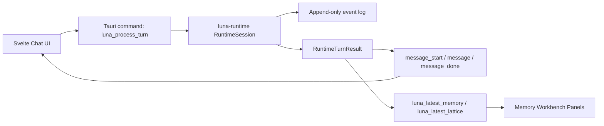

# Luna Desktop: Oxide Shell Adoption Plan

## Decision

Use `Oxide-Lab-main.zip` as the starting point for Luna's desktop chat shell, not as Luna's mind.

Oxide gives Luna a working Tauri v2 + Svelte 5 desktop interface with chat, history, settings, sidebar, model panels, streaming UI, and native app packaging. Luna keeps its own runtime, event log, memory lifecycle, provenance, replay audit, and doctrine gates.

The integration rule is simple:

> Oxide can provide the window, layout, interaction patterns, and desktop plumbing. Luna provides every memory decision and every answer contract.

## What We Keep First

- Tauri v2 desktop shell
- Svelte 5 frontend structure
- Chat layout
- Message list and composer
- Chat history sidebar pattern
- SQLite-backed session history pattern
- App settings layout
- Native window behavior
- Streaming event pattern: `message_start`, `message`, `message_done`

## What We Do Not Keep First

- Candle model runtime
- Hugging Face model download system
- GGUF/SafeTensors loading UX
- Device/GPU controls
- OpenAI-compatible local server
- Voice/STT controls
- Model card registry
- Prefix cache
- Performance panels tied to local inference

Those can return later only if Luna needs them and they pass Luna doctrine.

## First Architecture

## Required Luna Commands

The desktop backend should expose these Tauri commands before any model-loader work:

| Command | Purpose |
| --- | --- |
| `luna_process_turn` | Accept user text, run `RuntimeSession::process_user_turn`, persist the event log, return or stream Luna's reply. |
| `luna_get_memory_state` | Return current typed memory state for inspect panels. |
| `luna_get_attention_lattice` | Return the latest Attention Lattice. |
| `luna_explain_missing` | Power the "why not remembered?" UI. |
| `luna_run_replay_audit` | Show whether the current local log is replay-clean. |
| `luna_open_event_log` | Let the user choose or reveal the current Luna event log path. |

## UI Conversion Order

1. Create `apps/luna-desktop` from a reduced Oxide shell.
2. Rename package, product, window title, identifiers, and visible branding to Luna.
3. Remove model loading as a requirement for chat.
4. Replace `generate_stream` calls with `luna_process_turn`.
5. Keep the streaming message event shape so the UI remains responsive.
6. Add a right-side Luna workbench panel with:
   - current working memory
   - recalled facts
   - confidence/lifecycle labels
   - provenance source count
   - Attention Lattice scores
   - replay audit status
7. Add a correction-first interaction:
   - user sends correction in chat
   - Luna answers from current lifecycle state
   - workbench shows superseded claim and active replacement
8. Add a desktop smoke test that proves a correction survives app restart and replay audit.

## Build Guardrails

Every desktop slice must prove:

- UI is backed by Luna runtime output, not mock memory.
- Event log remains source truth.
- No hardcoded scenario answers.
- Inspect panel shows why a memory is active, suppressed, or missing.
- Replay audit can be run from the desktop path.
- Desktop code does not bypass runtime doctrine.
- Oxide-derived code keeps required Apache-2.0 attribution.

## First Slice Acceptance

The first PR is done when:

- `apps/luna-desktop` launches as Luna.
- The composer can send a message to Luna runtime.
- The assistant message renders Luna's runtime reply.
- A local event log is written.
- The UI shows latest Attention Lattice values after a turn.
- `cargo test -p luna-runtime --all-features` passes.
- Desktop type check/build command passes.

## Why This Favors Luna

Most chat apps hide memory behind the transcript. Luna's desktop must make memory visible while the conversation is happening.

The user should be able to see:

- what Luna remembered
- what Luna refused to treat as known
- why something was recalled
- what source event backs it
- what got superseded
- whether replay agrees with the current state

That is the product difference. The chat shell gets Luna onto the screen; the memory workbench proves Luna is not just another chatbot.
